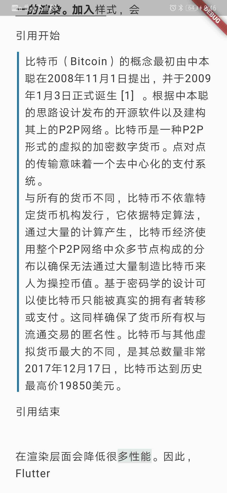
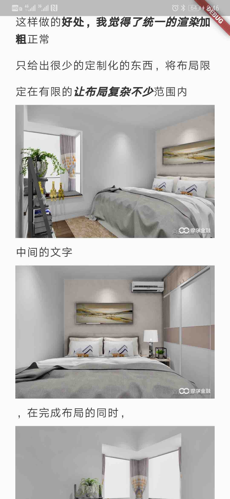
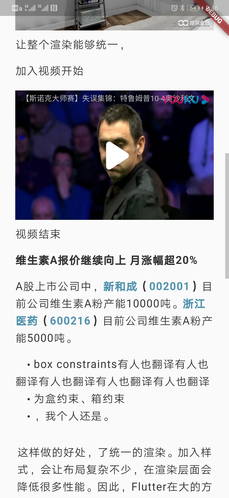
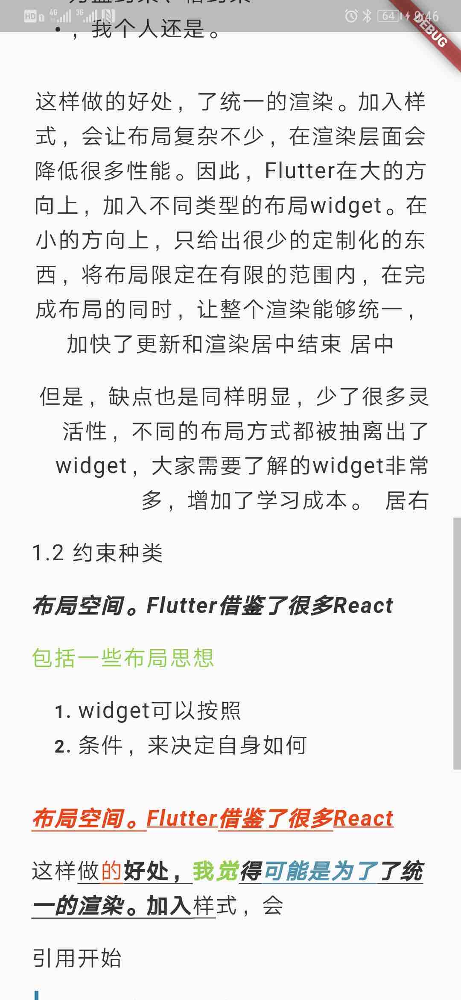

# flutter_html_text

把html解析为自定义Widget,可直接展示，使用方便快捷

## 功能
1. 图片解析展示
    1. 普通图片展示
    2. 长图切割展示
    3. 图片点击 跳转相册（相册没有在解析中实现，只返回了图片地址list）
    4. 可定义图片间距
2. 链接点击
3. webview视频播放(可直接播放，也可自定义处理)
4. 段落样式支持（居左 居中 居右 引用  段落间距）
5. 文字样式支持
    1. 字体大小
    2. 字体颜色
    3. a 链接是下划线定义
    4. 链接字体颜色
    5. 行高
    6. 数字标签前缀
    7. 数字标签大小
    8. 点标签前缀
    9. 点标签大小
    10. 引用样式
    11. 引用样式颜色 宽度 margin 相对位置
    12. 字符横向间距
    13. 单词间距
    14. 加粗 倾斜等常见样式

## 使用方法

同步解析
```
String html =
      '<p>这样<span style="text-decoration: underline;">做<span style="text-decoration: underline; color: #e8451a;">的</span><strong>好处，</strong></span><span style="text-decoration: none;"><strong><span style="text-decoration: none; color: #92cf4f;">我<em>觉</em></span></strong></span><span style="text-decoration: underline;"><strong><em>得</em><em><a href="https://www.imooc.com/article/details/id/31493" title="可能是为了" target="_blank">可能是为了</a>了统一的渲染</em></strong><strong>。加入</strong>样</span>式，会</p>';

HtmlTextView(html)
```
异步解析
```
HtmlParserToWidgetList(
      imagePadding:
          EdgeInsets.only(top: 2.0, left: 12.0, right: 12.0, bottom: 0.0),
      videoPadding:
          EdgeInsets.only(top: 4.0, left: 12.0, right: 12.0, bottom: 2.0),
      htmlTextStyle: HtmlTextStyle(
        height: 1.6,
        fontSize: valueOfPt(17),
        padding:
            EdgeInsets.only(top: 6.0, left: 12.0, right: 12.0, bottom: 8.0),
        digitalFontWeight: DigitalFontWeight.strong,
        digitalPrefix: '    ',
        pointPrefix: '    ',
        defaultTextColor: isNightStyle ? Color(0xff898989) : Color(0xff333333),
        letterSpacing: 1.0,
      ),
    )
    /// this.data 是需要解析的html
        .asyncParseHtmlToWidgetList(this.data,
            onTapCallback: this.onTapCallback, imageList: imageList, id: id)
        .then((nodes) {
      /// nodes 既为解析出的WidgetList
    });
```

## 预览

效果图如下：

|     |      |    |     |
| :--------------------------------: | :---------------------------------: | :-------------------------------: | :-------------------------------:  |


**觉得还可以的话，来个Star、Fork支持一波！有问题欢迎提Issue。**

